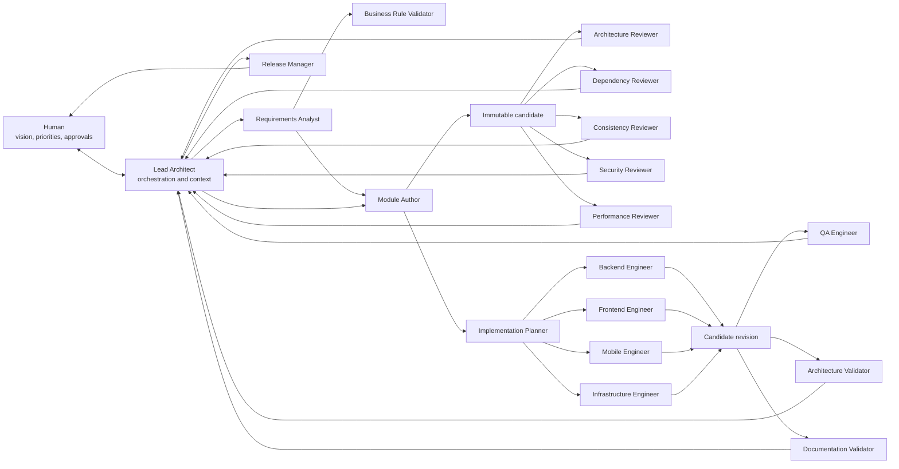

# Agent Interaction

```mermaid
flowchart LR
    H[Human\nvision, priorities, approvals] <--> LA[Lead Architect\norchestration and context]
    LA --> RA[Requirements Analyst]
    RA --> BRV[Business Rule Validator]
    RA --> MA[Module Author]

    MA --> CAND[Immutable candidate]
    CAND --> AR[Architecture Reviewer]
    CAND --> DR[Dependency Reviewer]
    CAND --> CR[Consistency Reviewer]
    CAND --> SR[Security Reviewer]
    CAND --> PR[Performance Reviewer]
    AR --> LA
    DR --> LA
    CR --> LA
    SR --> LA
    PR --> LA
    LA --> MA

    MA --> IP[Implementation Planner]
    IP --> BE[Backend Engineer]
    IP --> FE[Frontend Engineer]
    IP --> ME[Mobile Engineer]
    IP --> IE[Infrastructure Engineer]

    BE --> BUILD[Candidate revision]
    FE --> BUILD
    ME --> BUILD
    IE --> BUILD
    BUILD --> QA[QA Engineer]
    BUILD --> AV[Architecture Validator]
    BUILD --> DV[Documentation Validator]
    QA --> LA
    AV --> LA
    DV --> LA
    LA --> RM[Release Manager]
    RM --> H
```

Arrows represent artifact handoffs, not shared responsibility. The Lead Architect consolidates status but cannot replace specialist judgments.
