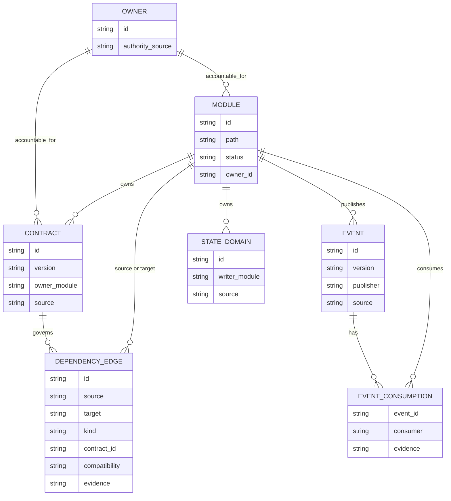

# Dependency Knowledge Model

To calculate synchronization scope, traverse changed nodes/edges in both directions, include contract/event/state owners, then stop only after all reachable active consumers are classified.
