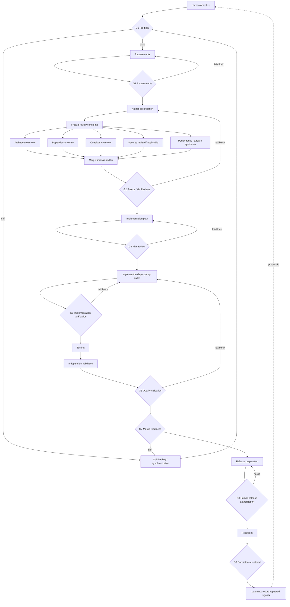

# Engineering Lifecycle

Reviews fan out only after one immutable candidate exists. Validation is independent from both authoring and review. Every gate is a bounded loop with a defined retry policy and termination condition (see [../constitution/LOOP_CONTROL.md](../constitution/LOOP_CONTROL.md)); the learning loop runs after G9 and proposes improvements without mutating policy.
