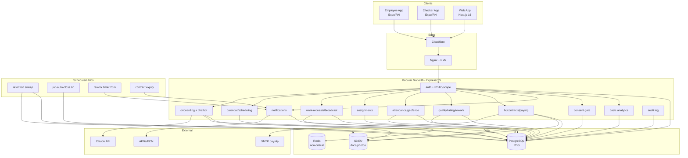
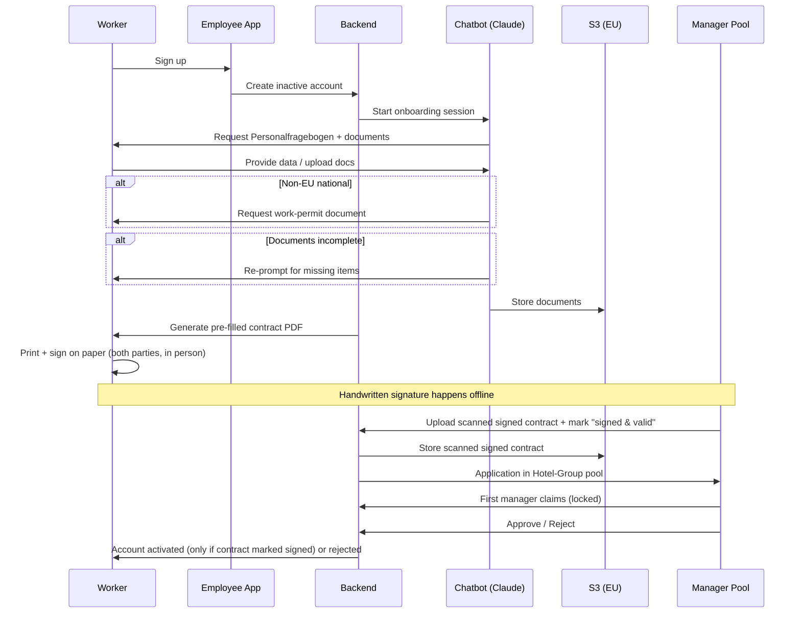
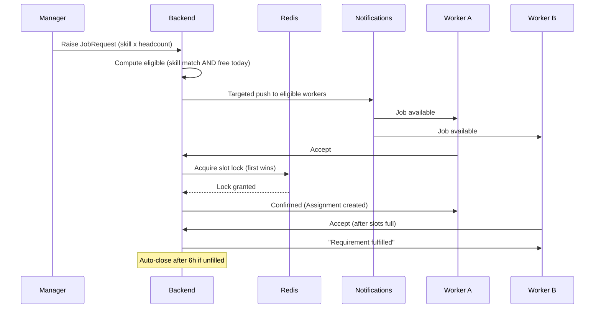
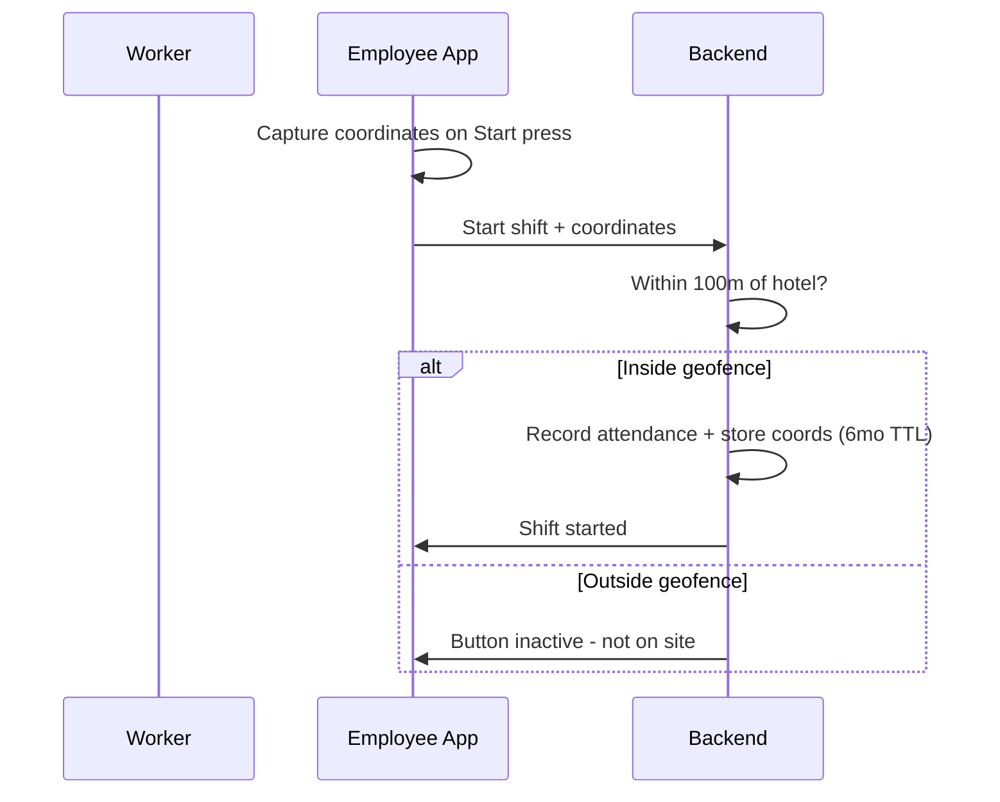

# HOTEL CRM → WORKFORCE OPERATIONS PLATFORM
## Pivot Design Document v1.0 — Definitive Technical Blueprint
**Status:** Source of Truth (supersedes all prior architecture documents)
**Client:** FHM Hotelservice GmbH (Frankfurt am Main, Germany)
**Vendor:** Zirove
**Market:** Germany only
**Date:** June 2026
**Audience:** Engineering, Product, Leadership
> This document is self-contained. A new engineer should be able to understand the entire system from this document alone, without reading any prior documentation. All previous architecture documents are archived (see Section 13).
---
## Document Control
| Item | Value |
|---|---|
| Supersedes | MASTER_ARCHITECTURE_v2.0, API_STANDARDS_v1.0, RBAC_PERMISSION_MATRIX_v1.0, DATABASE_RELATIONSHIP_DIAGRAM_v1.0, EVENT_FLOW_MAPPING_v1.0, and all earlier marketplace-era documents |
| Open items | 0 — all product questions resolved. Remaining items are non-engineering action items (DPA, DPO threshold, tax-advisor retention sign-off) |
| Build sequence | Documentation → code-gap closure → module build |
---
# 1. Executive Summary
## Why the pivot is happening
The deployed system was built as a **hospitality workforce marketplace**: hotels post work requests, workers browse and apply, a matching/rating engine ranks applicants, and managers select from applications. Through an extended requirements process with the client (FHM Hotelservice GmbH), it became clear the client does not operate a marketplace. They run a **permanent-staff workforce operations model**: a fixed pool of permanent employees who are scheduled by managers, dispatched to fill ad-hoc shortfalls, tracked by geofenced attendance, and assessed through manual photo-based quality inspection.
The two models are structurally incompatible at the job-fulfilment layer. A marketplace assumes workers discover and compete for work; this business assigns work directly and broadcasts only to fill gaps. Continuing on the marketplace architecture would mean building the wrong product on a foundation whose core assumptions contradict the business.
## Business goals
- Replace marketplace mechanics with a manager-driven scheduling and dispatch model.
- Provide legally compliant German employment onboarding (Personalfragebogen, work-authorization checks, qualified e-signature contracts).
- Enforce geofenced attendance so paid time reflects actual on-site presence.
- Maintain a manual but structured quality and rating loop that feeds a lightweight warning system.
- Operate fully within German/EU data-protection law (GDPR + BDSG), Germany-only.
## Technical goals
- Preserve the substantial, sound foundation already built (auth, RBAC, audit logging, notifications, attendance, quality/rating models, CI/CD, AWS infrastructure).
- Replace the `WorkRequest → WorkApplication → Assignment` chain with a `WorkRequest → targeted broadcast → first-accept → Assignment` flow.
- Add the net-new capability surface: calendar scheduling, geofencing, onboarding chatbot, contract storage (handwritten signature), daily consent gate, three-tier retention with automatic deletion, multilingual + RTL support, payslip request flow.
- Standardize the API response envelope behind a single builder.
## Expected outcome
A single coherent Workforce Operations Platform: one backend modular monolith, two mobile apps (Employee, Checker), one web app (manager/admin), deployed on the existing AWS stack, operating under German employment and data-protection law, with marketplace concepts fully removed.
---
# 2. Current System
This section describes exactly what exists in code today, per the codebase audit.
## 2.1 Architecture
- **Backend:** Node.js + TypeScript, Express 4, ESM modules. Modular monolith under `backend/src/modules/`. Prisma 5 ORM against PostgreSQL.
- **Frontend:** Next.js 16 / React 19, App Router, SWR for data fetching, Zustand for state, Tailwind v4.
- **Mobile:** Two Expo / React Native apps — `checker-app` and `worker-app`.
- **Infra:** AWS EC2 + RDS PostgreSQL, Nginx reverse proxy, PM2 process manager, GitHub Actions CI/CD (staging + production), Winston logging.
## 2.2 Current modules
`auth`, `users`, `crm`, `hr`, `quality`, `geo` (placeholder), `chatbot` (placeholder), `calendar`, `analytics`, `attendance`, `assignments`, `notifications`, `work-requests`, `work-applications`, `hotel-workers`. Each module follows a `controller.ts / service.ts / routes.ts / types.ts` layout.
## 2.3 Current data model (marketplace era)
| Model | Purpose |
|---|---|
| User, Session | Auth — role + granular `permissions[]`, soft delete via `deleted_at` |
| Hotel, HotelWorker | Roster; HotelWorker lifecycle INVITED→ACTIVE→SUSPENDED→REMOVED |
| WorkRequest | Shift posting; `version` optimistic lock, `workers_needed/confirmed` |
| **WorkApplication** | Worker applies to a request (unique per worker+request) |
| WorkerAssignment | Created from an accepted application (mandatory FK `application_id`) |
| Attendance | 1:1 with assignment, `is_verified` flag |
| QualityVerification, Rating, WorkerOverallRating | Quality + rating + materialized aggregate |
| Notification | Typed enum events, multi-channel |
| AuditLog | Immutable compliance log |
## 2.4 Current workflow (marketplace)
```
Manager posts WorkRequest → Workers browse & submit WorkApplications →
Manager/algorithm selects → WorkerAssignment created → Attendance → Quality → Rating
```
## 2.5 API response shape
Defined as a TypeScript interface in `lib/types.ts` (`{ status, data?, error?, meta }` and a `PaginatedResponse`). The **error path is centralized** in `middleware/errorHandler.ts` and is the canonical implementation. The **success path is not** — 16 controllers construct the envelope inline. A naming mismatch exists: `PaginationParams` uses `per_page` while `utils.parsePaginationParams` returns `limit`.
## 2.6 Current deployment flow
GitHub Actions → build/test → deploy to staging or production on AWS EC2; Nginx fronts the app; PM2 supervises the Node process; RDS PostgreSQL is the database; secrets via environment files.
## 2.7 Current dependencies (backend, audit-relevant)
`@prisma/client ^5.12`, `express ^4.18`, `bcryptjs ^2.4`, `jsonwebtoken ^9.0`, `winston ^3.11`, `zod ^3.22`, `dotenv ^16.3`. Tests via `ts-jest` ESM preset (13 test files).
---
# 3. Existing Pain Points
| # | Area | Problem | Consequence |
|---|---|---|---|
| 1 | Job fulfilment model | `WorkApplication` assumes workers browse & compete for work | Directly contradicts the confirmed business model; the central flow is wrong, not just incomplete |
| 2 | Domain framing | Schema and naming describe a "marketplace (V2, SP-1..SP-9)" | Every downstream assumption (matching, ranking, applications) is built on a premise the client rejected |
| 3 | API consistency | Success envelope duplicated across 16 controllers; `per_page` vs `limit` mismatch | Divergence risk, pagination bugs, harder maintenance |
| 4 | Placeholders | `geo` and `chatbot` are empty placeholders | Two confirmed core features (geofencing, onboarding agent) have no implementation |
| 5 | Compliance gap | No consent log, no retention/auto-deletion jobs, no special-category data handling | The system is not yet German-employment-law compliant despite handling employee PII |
| 6 | Onboarding gap | No Personalfragebogen model, no contract storage, no work-permit field | Legally required German onboarding cannot occur |
| 7 | i18n gap | No multilingual or RTL support | Cannot serve the required 12-language, RTL-inclusive workforce |
| 8 | Analytics scope | An `analytics` module exists from the marketplace era | Needs to be reduced to a minimal, intentional scope rather than marketplace reporting |
None of these undermine the foundation. Items 1–2 require a flow redesign; the rest are additive feature work on a sound base.
---
# 4. New Requirements
Every requirement below is confirmed by the client. Each lists why it is needed and what it affects.
## 4.1 Roles & access
- **Five roles:** Staff (Worker), Checker, Hotel Manager, Regional Manager (new), Admin. No Supervisor role.
  - *Why:* Regional Manager oversees a Hotel Group; Manager is scoped to one hotel. Affects RBAC, JWT claims, every permission check, UI scoping.
- **Login:** password; auto-logout after 1 week; forgot-password reset.
- **MFA:** required for managers (Hotel Manager and above); not for Staff/Checker.
- **Failed login:** notify manager; **no** lockout, **no** rate-limiting.
- **No background checks** anywhere in the system.
## 4.2 Onboarding (German-law compliant)
- **Personalfragebogen at signup** (self-service digital form): first/last name, DOB, nationality, place & country of birth, address, bank account holder, IBAN, tax ID (Steuer-ID), health insurance provider (Krankenkasse), social security number (Sozialversicherungsnummer), employment type (Teilzeit/Minijob — stored only), work start date, signed declaration.
  - *Why:* Legally required to register a worker with German authorities before they may work.
- **Work-permit / residence data** required **only** for non-EU/EEA/Swiss nationals (EU citizens are exempt).
- **Onboarding chatbot (Claude agent):** collects required documents conversationally; re-prompts on incomplete uploads; account stays inactive until complete.
- **Contract:** system generates a pre-filled PDF → printed → signed **by hand** on paper in person (no e-signature/QES) → **manager uploads the scan and marks it signed** (Option A), which activates the account. Lifecycle: 1-year fixed-term (incl. 6-month probation, 2-week notice during probation) → optional +1-year extension (no new probation) → permanent (open-ended) after 2 years.
- **Approval:** completed application routed to the **Hotel Group manager pool**; first manager to open **claims** it (locked to prevent double-review); approves or rejects.
- **Familiarization & probation:** a familiarization period of **max 2 trial days** precedes any contract; both parties must agree to proceed. Suitability is a **manual manager judgment**. The 6-month probation period sits inside the initial 1-year fixed-term contract.
## 4.3 Hotels & groups
- One dedicated manager per hotel; Hotel Groups aggregate hotels under a Regional Manager.
- Pause-jobs toggle per hotel (simple control).
- **No** room/floor/building/zone system.
- New hotels addable over time (scalable). **Hotel creation is Admin/HQ only**; Regional/Property Managers receive scoped permissions for assigned hotels and cannot create hotels or modify hotel groups.
## 4.4 Jobs & assignment (the core pivot)
- **Primary — Calendar/weekly plan:** Manager places workers on a calendar day-by-day. Direct assignment, **no accept step**; the shift appears on the worker's calendar.
- **Fallback — Broadcast job request:** Fired only when a manager explicitly raises a standalone job request (never from calendar edits). Manager specifies skill(s) and headcount per skill. Only workers with the matching skill **who are free that day** are notified. First-accept wins; tie-break by earliest server-received timestamp. When slots fill, remaining responders are notified "requirement fulfilled."
- **Auto-close:** an unfilled job request closes automatically after **6 hours**, or the manager closes it manually sooner.
- **Daily exclusivity:** once assigned anything for a day (calendar or broadcast), a worker is blocked from any further assignment that day.
- **Removed:** worker-initiated applications, auto-matching engine, SLA/urgency tiers, recurring jobs.
## 4.5 Scheduling, sick & vacation
- Manager builds the weekly plan via a calendar interface; workers view their own calendar.
- Worker can mark a current or future day **sick** or **vacation** — calendar flag only; no doctor's note, no cap, no advance notice, no approval. Manager is notified.
- Marking sick or vacation **auto-cancels** any existing assignment that day.
- Vacation is a label only — **no balance tracking**.
## 4.6 Quality, ratings & warnings
- Checker uploads a photo + a 0–100 score directly to the worker's profile.
- Rating tiers; recency-weighted average (last 10 jobs weighted most).
- **Warnings:** worker notified at rating < 70 (first warning); at < 50 (second warning) the **manager** receives a specific notification and handles it manually thereafter.
- Inspection checklist items: dust, bathroom, bed linen, mirror, floor, minibar/restocking, fragrance/amenities, other.
- **Rework loop:** Checker assigns rework to a specific worker → worker notified via **in-app inbox + push** → worker uploads photo + marks done → Checker notified. If not completed within **20 minutes**, both Manager and Checker are notified.
- **Removed:** dispute window, formal dispute resolution, auto-reward engine.
## 4.7 Location & attendance
- Location required **only at the moment** the Start/Close shift buttons are pressed (not continuous).
- **Geofence radius: 100 m** from the hotel; buttons do not function outside it.
- Actual coordinates captured at each clock-in/out; **deleted after exactly 6 months** (automatic).
## 4.8 Notifications
- **Push only**, system-wide.
- Declining the daily consent gate blocks access **and** notifies the manager.
## 4.9 Manager operations (manual entry)
- Manager logs reception data: checkouts, long-stay guests, long-stay-without-service.
- Manager logs rooms completed per worker (compared against task start).
- Active-worker-today visibility for Manager, Regional Manager, Admin.
## 4.10 Availability indicator
- Red = unavailable today; Green = available today. **Today only** (not date-sensitive).
## 4.11 Search & basic analytics
- Search/filter workforce by hotel; designed to scale as hotels are added.
- **Basic analytics only** (scope defined in Section 7) — full marketplace analytics removed.
## 4.12 Payroll (out of system)
- Payslip **request** flow: worker requests → manager emails manually. Worker cannot self-retrieve.
- **No** calculation, overtime, bonuses, deductions, or exports in-system.
## 4.13 GDPR & compliance
- **Daily consent gate:** GDPR notice must be accepted once per calendar day before access; decline → block + notify manager. Shown in all supported languages.
- **Three-tier retention, all automatic deletion:** shift coordinates 6 months; general data 5 years; payroll/tax-adjacent fields 6 years.
- **Subject-rights requests** (access/export): automatic, via button or chatbot.
- **Special-category data** (Konfession, disability): restricted visibility, voluntary, tied to named legal bases, every access audit-logged.
- **No** working-hours warning rule.
- Vendor relationship requires an **Art. 28 DPA** between Zirove and FHM Hotelservice GmbH (business/legal task).
## 4.14 Platform
- **Languages (12):** German, English, Urdu (RTL), Arabic (RTL), Russian, Italian, Polish, Turkish, French, Spanish, Danish, Sorbian.
- **Mobile apps:** Employee App (renamed from Worker/Staff), Checker App (unchanged).
- **Chatbot:** Claude API agent (claude-haiku for cost), hard monthly token cap in config, per-conversation limit with graceful fallback to a static UI flow.
---
# 5. Final Architecture
## 5.1 Architectural style
The system remains a **modular monolith** on the existing stack. This is a deliberate decision (see Section 11): the team size, the single-tenant-per-client deployment, and the tightly-coupled employment workflows do not justify microservice overhead. Modules retain clear internal boundaries so that any high-load module (notifications, chatbot) can be extracted later if needed.
## 5.2 High-level layers
| Layer | Technology | Responsibility |
|---|---|---|
| Clients | Employee App, Checker App (Expo/RN); Web app (Next.js) | UI, capture location at clock-in/out, render calendar, run consent gate |
| Edge | Nginx + Cloudflare | TLS, reverse proxy, rate limiting at edge |
| API | Express modular monolith | Auth, business logic, validation, response envelope |
| Data | PostgreSQL (RDS) | System of record |
| Cache | Redis (non-critical) | Cache, broadcast slot locks, rate-limit counters |
| Storage | S3 (EU region) | Documents, contracts, inspection/rework photos |
| Async | Scheduled jobs (node-cron / BullMQ on Redis) | Retention deletion, job-request auto-close, rework timers |
| External | Claude API (chatbot), APNs/FCM (push), SMTP (payslip emails) | Third-party integrations |
## 5.3 Authentication
- JWT access token (short-lived) + refresh token (long-lived; 1-week inactivity logout).
- MFA enforced for Hotel Manager, Regional Manager, Admin.
- Token claims carry `user_id`, `role`, and **scope** (the hotel or hotel-group the user may act within), so authorization checks are cheap.
## 5.4 Authorization (RBAC + scope)
Two-dimensional model: **role** (what actions) × **scope** (which hotels).
| Role | Action scope | Data scope |
|---|---|---|
| Staff (Worker) | Own profile, own calendar, own jobs, clock-in/out | Self only |
| Checker | Submit quality scores, assign rework, view assessed workers | Assigned hotel |
| Hotel Manager | Schedule, raise job requests, approve onboarding, manage hotel | One hotel |
| Regional Manager | All Hotel-Manager actions across the group | All hotels in group |
| Admin | System-wide; hotel creation (Admin/HQ only); account deletion | All |
Deny-by-default. Cross-hotel access requires the actor's scope to include the target hotel. Special-category fields (Konfession, disability) sit behind a restricted sub-permission, audit-logged on every access.
## 5.5 Event & job flow (the pivot core)
The marketplace `WorkApplication` step is removed. Two assignment paths replace it:
1. **Calendar (direct):** manager writes assignments to the calendar; no worker acceptance; worker calendar reflects it.
2. **Broadcast (gap-fill):** manager raises a `JobRequest`; the system computes eligible workers (matching skill ∧ free that day), sends targeted push, and the first acceptance to win a Redis slot lock creates the `WorkerAssignment`. Slot exhaustion notifies losers; a 6-hour timer (or manual action) closes the request.
## 5.6 Background jobs
| Job | Trigger | Action |
|---|---|---|
| Retention sweep | Daily | Delete shift coords > 6 months; general data > 5 years; payroll/tax data > 6 years |
| Job-request auto-close | 6h after creation | Close unfilled `JobRequest`, notify manager |
| Rework timer | 20 min after rework assigned | If incomplete, notify Manager + Checker |
| Contract expiry reminder | Daily | Notify manager before 1-year contract end, and again before the 2-year end; no reminders once permanent |
| Chatbot budget guard | Continuous | Enforce monthly token cap; fall back to static UI |
## 5.7 Caching, storage, logging, errors
- **Redis** is explicitly non-critical: cache + broadcast slot locks + rate-limit counters. If it fails, the app degrades (slower, broadcast falls back to a short DB transaction lock) but stays up.
- **S3 (EU):** all documents, contracts, photos. No data leaves the EU/EEA.
- **Logging:** Winston structured logs; audit log is a separate immutable table.
- **Errors:** the existing centralized `errorHandler.ts` envelope is canonical; the success path is refactored behind `sendSuccess()` / `sendPaginated()` to match.
---
# 6. Architecture Diagram

---
# 7. Component Design
## 7.1 Onboarding + Chatbot
- **Purpose:** Capture legally required German employment data and documents; produce a signed contract.
- **Inputs:** Personalfragebogen fields; uploaded documents; nationality (drives work-permit requirement); contract signature.
- **Outputs:** Inactive account pending approval; document set in S3; hand-signed contract stored in-system; entry in the Hotel-Group approval pool.
- **Dependencies:** Claude API (claude-haiku), S3.
- **Failure modes:** Claude budget exhausted → fall back to static checklist wizard; incomplete docs → chatbot re-prompts, account stays inactive.
- **Scalability:** Token cap + haiku keep cost bounded; static fallback removes hard dependency on the model.
## 7.2 Calendar / Scheduling
- **Purpose:** Primary assignment path — managers place workers per day.
- **Inputs:** Manager edits; worker sick/vacation flags.
- **Outputs:** Worker calendar entries; daily availability state.
- **Failure modes:** Sick/vacation flag must atomically cancel a same-day assignment (single transaction) to avoid a worker showing both assigned and on-leave.
## 7.3 Job Requests / Broadcast
- **Purpose:** Gap-fill dispatch.
- **Inputs:** Manager request (skills × headcount); eligible-worker computation.
- **Outputs:** Targeted push; assignments on first-accept; "fulfilled" notifications to losers.
- **Dependencies:** Redis slot locks.
- **Failure modes:** Concurrency on the last slot resolved by Redis lock → first timestamp wins; Redis down → fall back to a `SELECT ... FOR UPDATE` DB transaction. Auto-close after 6h prevents zombie requests.
## 7.4 Attendance / Geofence
- **Purpose:** Verify on-site presence at clock-in/out.
- **Inputs:** Device coordinates at button press; hotel coordinates; 100 m radius.
- **Outputs:** Verified attendance record; stored coordinates (6-month TTL).
- **Failure modes:** GPS drift near large buildings mitigated by 100 m radius; outside radius → button disabled, no clock event.
## 7.5 Quality / Rating / Rework
- **Purpose:** Manual inspection loop feeding ratings and warnings.
- **Outputs:** 0–100 score on profile; recency-weighted aggregate; warning notifications (<70, <50); rework assignments with a 20-minute escalation timer.
## 7.6 Consent Gate
- **Purpose:** Enforce daily GDPR-notice acknowledgment.
- **Inputs:** Worker acceptance per calendar day; current notice version.
- **Outputs:** Access granted for the day; consent-log entry; on decline → access blocked + manager notified.
## 7.7 HR / Contracts / Payslip
- **Purpose:** Generate contracts, hold scanned hand-signed contracts, track lifecycle/expiry, handle payslip requests.
- **Contract flow (handwritten, manager-confirmed — Option A):** system generates a pre-filled PDF from Personalfragebogen data → made available to print → both parties sign on paper in person → **manager uploads the scan and marks "signed & valid"** → status flips to signed/active, account activates, 1-year expiry clock starts.
- **Inputs:** Worker data for PDF generation; scanned signed contract upload; manager confirmation.
- **Outputs:** Generated contract PDF; stored scanned signed contract (S3 EU); contract status (pending → signed → active); expiry reminders (before 1yr, before 2yr, none once permanent); payslip request → manager email (manual). No payroll computation.
- **Trust boundary:** system does NOT capture, verify, or auto-detect the signature — it records the manager's confirmation and stores the evidence.
- **Failure modes:** account cannot activate until a contract file is uploaded AND marked signed; a visible "contract pending signature" status prevents forgotten contracts; bad/blurry scan is a manual re-upload.
---
# 8. Complete System Flow
## 8.1 Onboarding sequence

## 8.2 Broadcast job-request sequence

## 8.3 Geofenced clock-in

---
# 9. Data Model
## 9.1 Models retained (modified)
| Model | Change |
|---|---|
| User, Session | Add scope (hotel/group); add Regional Manager role; keep soft delete |
| Hotel, HotelWorker | Keep; HotelWorker becomes the permanent-employment record |
| WorkRequest | Repurposed as broadcast `JobRequest`; drop application linkage |
| WorkerAssignment | Drop mandatory `application_id`; created directly from calendar or broadcast accept |
| Attendance | Add geofence verification + stored coordinates (6-month TTL) |
| QualityVerification, Rating, WorkerOverallRating | Keep; feed warning thresholds |
| Notification | Keep; push-only channel |
| AuditLog | Keep; extend for special-category access logging |
## 9.2 Models removed
`WorkApplication` (and its accepted-application linkage). Marketplace matching/ranking concepts.
## 9.3 Models added
| Model | Purpose |
|---|---|
| PersonalData | Personalfragebogen fields (incl. restricted Konfession, disability) |
| WorkerDocument | Uploaded docs + expiry; work-permit (non-EU only) |
| Contract | Generated PDF + stored **scanned** hand-signed contract; status (pending→signed→active) set by manager confirmation; lifecycle (1yr fixed-term → +1yr → permanent); 6-month probation; expiry-reminder state |
| ConsentLog | Daily consent acceptance (per day, per notice version) |
| RetentionLog | Tracks deletion eligibility per data category |
| CalendarEntry | Per-worker per-day assignment / sick / vacation |
| JobRequest | Broadcast request (skills × headcount, 6h auto-close) |
| PayslipRequest | Worker request → manager fulfilment |
| ReworkTask | Checker→worker rework + 20-min timer |
| ReceptionData | Manager-entered checkout / long-stay data |
## 9.4 Indexing & integrity
- Partial unique index enforcing one active assignment per worker per day (daily exclusivity).
- Index on `(skill, hotel_id)` and availability for fast eligible-worker computation.
- CHECK constraints and the active-assignment partial unique index live in migrations (consistent with current practice).
- Coordinates, payroll/tax fields, and general PII tagged by retention category for the sweep job.
## 9.5 Lifecycle & extensibility
HotelWorker is now an employment record (permanent staff who earn only when assigned). The schema is designed so a future room/scheduling expansion (currently out of scope) can attach to CalendarEntry and JobRequest without restructuring.
---
# 10. Migration / Pivot Strategy
The system is pre-launch with no production employee data, which removes the hardest migration risk (live data reshaping). The strategy is therefore a **forward refactor**, not a dual-running migration.
## Phase 1 — Foundation realignment
- Add Regional Manager role + scope to auth/RBAC.
- Refactor the success response path behind `sendSuccess()` / `sendPaginated()`; fix `per_page`/`limit` mismatch.
- Remove `WorkApplication`; repoint `WorkerAssignment` to direct creation.
- Re-label the schema away from "marketplace"; reduce `analytics` to the basic scope (Section 7/Appendix).
## Phase 2 — Core new modules
- Calendar/scheduling + daily exclusivity + sick/vacation auto-cancel.
- Broadcast JobRequest + Redis slot lock + 6h auto-close.
- Attendance geofence (100 m) + coordinate storage.
- Quality/rework 20-minute timer + warning thresholds.
## Phase 3 — Compliance & onboarding
- Personalfragebogen + WorkerDocument + work-permit gating (non-EU).
- Onboarding chatbot (Claude/haiku) with budget guard + static fallback.
- Contract storage (hand-signed; lifecycle + expiry reminders).
- Daily consent gate + ConsentLog.
- Three-tier retention sweep (6mo / 5yr / 6yr) + special-category handling.
- Payslip request flow.
## Phase 4 — Platform & polish
- 12-language i18n + RTL (Arabic, Urdu).
- Red/green availability indicator.
- Basic analytics.
- Subject-rights (access/export) via button/chatbot.
## Rollback, flags, risk
- **Feature flags** gate each new module so partial deploys are safe (the `FEATURE_*` env convention already exists in the codebase).
- **Rollback:** because phases are additive and pre-launch, rollback = disable the flag + redeploy prior build.
- **Backward compatibility:** only the removal of `WorkApplication` is breaking; it is done in Phase 1 before any client depends on it.
- **Success criteria per phase:** all module tests green, envelope conformance check passes, RBAC/scope tests pass, retention sweep verified on seed data.
---
# 11. Engineering Decisions
| Decision | Reason | Alternatives | Trade-off / Long-term |
|---|---|---|---|
| Keep modular monolith | Team size + single-tenant deploy; employment workflows are tightly coupled | Microservices | Simpler ops now; extract hot modules later if needed |
| Remove `WorkApplication`; broadcast model | Business assigns work directly, not via competition | Keep applications | One-time breaking change, done pre-launch |
| Redis slot lock for broadcast concurrency | Cheap, fast first-accept arbitration | DB lock only | Redis non-critical; DB `FOR UPDATE` fallback retained |
| claude-haiku + token cap + static fallback | Bound chatbot cost; never hard-block onboarding | Larger model, no cap | Lower reasoning ceiling, acceptable for structured doc collection |
| Handwritten contract signing | Client rejected QES for cost + employee friction; hand signature is legally sufficient here | QES via Skribble/DocuSign/Yousign | No e-signature integration to build/maintain; manual upload step instead |
| Three-tier retention | German law differs by data type (6mo ops / 5yr general / 6yr tax) | Flat 5-year | More logic, but legally correct |
| 100 m geofence | GPS drift near large buildings | Tighter radius | Fewer false negatives; per-hotel tuning possible later |
| Centralize success envelope | 16 controllers diverge today | Leave inline | One-time refactor, lasting consistency |
| Push-only notifications | Client decision | Multi-channel | Simpler; SMS/email can be added if required |
---
# 12. Implementation Roadmap
| Milestone | Objectives | Key deliverables | Depends on | Validation |
|---|---|---|---|---|
| M1 Foundation | Roles, envelope, remove applications | RM role+scope; `sendSuccess`; broadcast-ready assignment | Audit §6–12 | RBAC + envelope tests green |
| M2 Dispatch | Calendar + broadcast | CalendarEntry, JobRequest, slot lock, 6h close, daily exclusivity | M1 | Concurrency + exclusivity tests |
| M3 Field ops | Attendance + quality | Geofence clock-in, coord storage, rework 20m timer, warnings | M2 | Geofence + timer tests |
| M4 Compliance | Onboarding + GDPR | Personalfragebogen, chatbot, contract storage (hand-signed) + lifecycle, consent gate, retention, special-category | M1 | Retention sweep + consent tests |
| M5 Platform | i18n + UX | 12 languages, RTL, red/green, basic analytics, payslip request, subject-rights | M2–M4 | i18n + RTL + export tests |
| M6 Hardening | Pre-production | Load test, security review, DPA in place, runbook | M1–M5 | Sign-off checklist |
---
# 13. Next Steps
## Step 1: Update Documentation (do this first)
**Create (this document is the anchor):**
- `PIVOT_DESIGN_DOCUMENT_v1.0.md` (this file) — source of truth.
- New per-module specs derived from Sections 7–9 as each milestone starts.
**Archive (mark superseded, do not delete):**
- `MASTER_ARCHITECTURE_v2.0.md`, `API_STANDARDS_v1.0.md`, `RBAC_PERMISSION_MATRIX_v1.0.md`, `DATABASE_RELATIONSHIP_DIAGRAM_v1.0.md`, `EVENT_FLOW_MAPPING_v1.0.md`, and all marketplace-era documents.
**Update:**
- `README.md` to point to this document as the entry point.
- API standards: regenerate from the refactored envelope once `sendSuccess` lands.
**Structure / ownership / versioning:**
- One `/docs` root; this document at the top; module specs beneath.
- Owner: Mayank (Lead). Reviewers: Ritik (PM), client stakeholder for scope items.
- Semantic doc versioning (v1.0 → v1.1 for additive, v2.0 for structural).
## Step 2 onward (execution order)
1. Complete code audit sections 6–12 (auth middleware, roles enum, env validation, module list, migrations, routes, DB connection) → finalize the gap list.
2. Execute M1 → M6 per the roadmap, each behind a feature flag.
3. Put the Zirove ↔ FHM Art. 28 DPA in place before production (parallel, legal track).
4. Production rollout after M6 hardening sign-off.
---
# 14. Appendix
## Glossary
- **Personalfragebogen** — German new-hire data form, legally required before employment.
- **Familiarization period** — up to 2 trial days before any contract is concluded, to assess mutual fit. (Note: QES/e-signature was evaluated but rejected — contracts are signed by hand.)
- **Konfession** — religious affiliation (collected only for church tax); special-category data.
- **Hotel Group** — set of hotels under one Regional Manager.
- **Broadcast / JobRequest** — gap-fill dispatch to eligible workers; first-accept wins.
- **Daily exclusivity** — a worker assigned anything on a day cannot take another assignment that day.
## Assumptions (inferred, labelled)
- Redis (currently used as non-critical cache) hosts broadcast slot locks and BullMQ jobs; if absent, DB transaction locks and node-cron substitute.
- S3 in an EU region is the document/photo store (consistent with "no data leaves EU/EEA").
- Basic analytics = active workers/day, rooms-completed per worker, rating/warning counts, sick/vacation counts per hotel — derived from existing data, no new pipeline.
## Open questions
**None — all product questions resolved.** For reference, the previously open items were resolved as:
1. **Probation / contract shape** — familiarization max 2 trial days; then a 1-year fixed-term contract with a 6-month probation (2-week notice during probation); optional +1-year extension (no new probation); permanent after 2 years. Signed **by hand** (no QES).
2. **Contract expiry** — reminders before the 1-year and 2-year ends; none once permanent.
3. **Hotel creation** — Admin/HQ only; Regional/Property Managers are scoped to assigned hotels and cannot create hotels or modify groups.
Remaining non-engineering **action items** (do not block build): Art. 28 DPA (Zirove ↔ FHM), DPO threshold tracking (§38 BDSG, client side), tax-advisor sign-off on the 6-year retention mapping.
## Non-goals
Marketplace/matching engine; worker-initiated applications; room/floor/zone system; in-system payroll calculation; SLA/urgency tiers; recurring jobs; dispute resolution; auto-reward engine; working-hours hard enforcement; multi-country support; offline-first; QES / e-signature integration (contracts are signed by hand).
## References
- Codebase audit (sections 1–5 received; 6–12 pending).
- German law: §257 HGB / §147 AO (retention), §26 BDSG / Art. 13 GDPR (employee data notice), §38 BDSG (DPO threshold), §14 TzBfG (fixed-term employment). Note: contracts are signed by hand, so QES/eIDAS e-signature law does not apply.
- Confirmed requirements: full client requirements conversation (this engagement).
